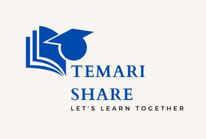

# Temari Share ~ Let’s learn together

## Introduction

### The Project

Temari Share is a student-centered educational resource management system that allows students to share modules, presentations, documents, tutorial videos, projects, assignments, and other educational resources.

### The Context

This project is our Portfolio Project, concluding our Foundations Term at [ALX School](https://www.alxafrica.com/). We were able to choose who we wanted to work with and what we wanted to work on, as long as we present a working program at the end of the three weeks of development.

### The Team

#### Nazrawi Medhin

[Github Profile](https://github.com/nazrawimedhin)

* Product owner
* Front-end developer

#### Dereje Desta

[Github Profile](https://github.com/dere7)

* Project manager
* Back-end developer

#### Robel Abebe

[Github Profile](https://github.com/Robi000)

* Quality assurance engineer
* Back-end developer

### Blog Posts

## Tutorial

## Architecture

## Acknowledgements

## Related Projects

## License
